# Group6-Project4_EURUSD_Prediction_Model

EUR/USD Exchange Rate Prediction Using Support Vector Regression

Project by Deldata Musa,Ullah Qadir Masih, and Xiao Guangyu Richard
________________________________________
Overview

This project aims to predict the EUR/USD exchange rate using historical data and Support Vector Regression (SVR). The SVR model is optimized through hyperparameter tuning to enhance its prediction accuracy. The project involves data collection, preprocessing, model training, evaluation, and visualization of the results.

Table of Contents

•	Data Collection and Preparation
•	Feature Engineering
•	Data Splitting and Scaling
•	Model Training and Evaluation
•	Hyperparameter Tuning
•	Visualization and Results
•	Conclusion
•	Final Results
•	How to Run the Project

Data Collection and Preparation

Data Source

We utilized historical data of the EUR/USD exchange rate from Yahoo Finance, covering the period from January 1, 2010, to May 13, 2024.

Data Extraction

The data was fetched using the yfinance library:
 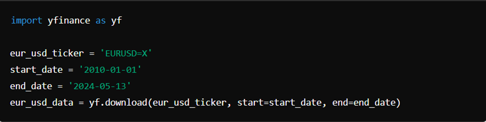

Data Cleaning

We ensured data integrity by dropping any rows with missing values:
 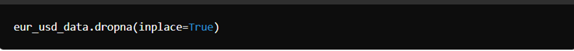

Storing Data

For future reference and further analysis, the cleaned data was stored in an SQLite database using SQLAlchemy:
 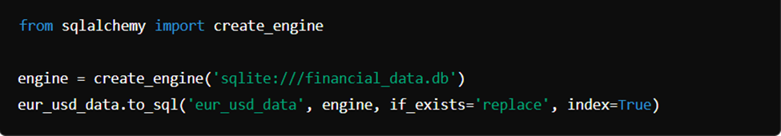

Feature Engineering

Return Calculation
We introduced a new feature, Return, which is the percentage change in the closing price:
 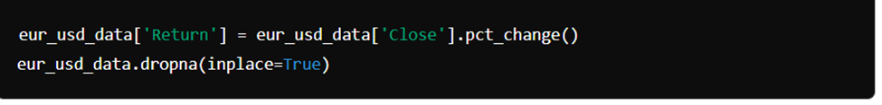

Feature and Target Selection

The features and target variable were defined as follows:
 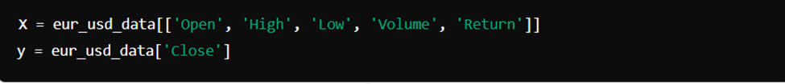

Data Splitting and Scaling

Splitting the Data

The dataset was split into training and testing sets:
 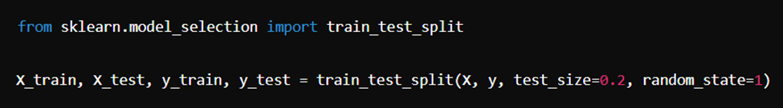

Standardization

To ensure all features contribute equally to the model, the data was standardized:
 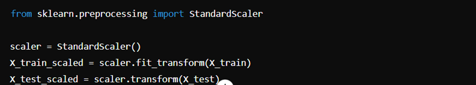

Model Training and Evaluation

Initial Model

An SVR model with an RBF kernel was initialized and trained:
 

Evaluation Metrics

The initial model was evaluated using R-squared and Mean Squared Error (MSE):
 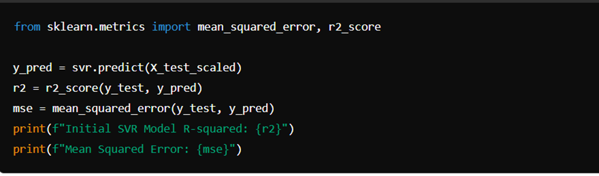

Feature Importance

Permutation importance was calculated to determine feature significance:
 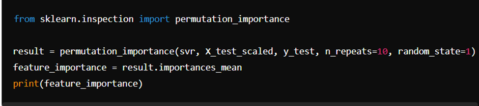

Hyperparameter Tuning

GridSearchCV

To optimize the SVR model, GridSearchCV was employed:
 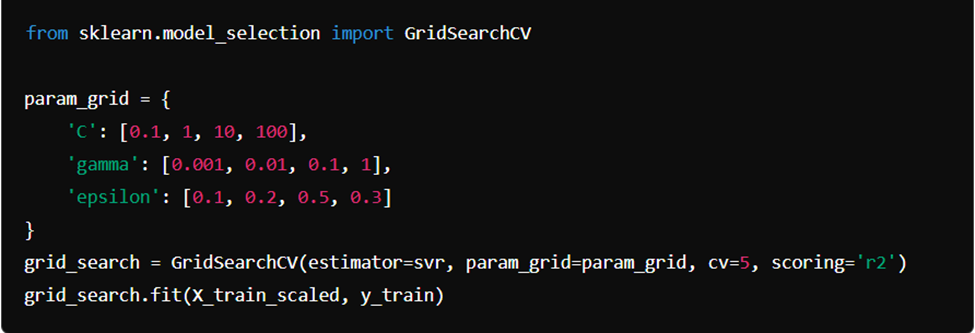

Best Model

The best model parameters were identified and used to retrain the SVR:
 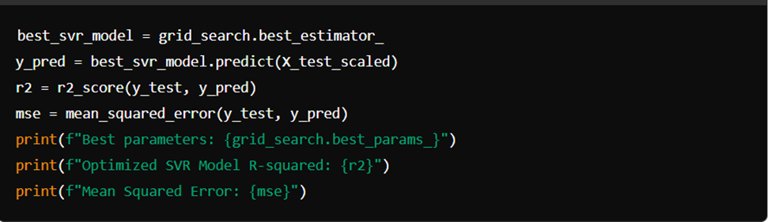

Visualization and Results

Actual vs Predicted Prices

The performance of the SVR model was visualized:
 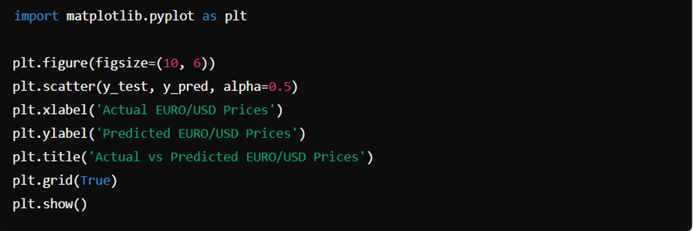

Model Comparison

A bar chart was plotted to compare the R-squared values of the initial and optimized models:

 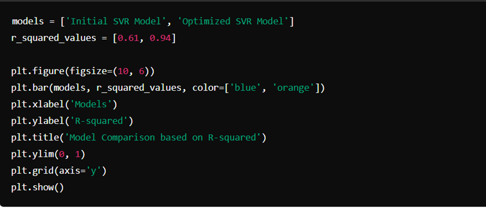

Documentation

The results of the GridSearchCV were documented:
 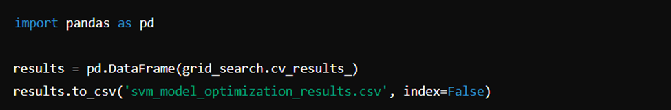

Conclusion

The project successfully predicted the EUR/USD exchange rate using an optimized SVR model. The optimization process significantly improved the model's performance, increasing the R-squared value from 0.61 to 0.94, and reducing the Mean Squared Error. The findings demonstrate the effectiveness of SVR in financial time series prediction and highlight the importance of hyperparameter tuning in improving model accuracy.

Final Results

•	Optimized Model R-squared: 0.9442
•	Mean Squared Error: 0.0008

How to Run the Project

1.	Clone the repository:
 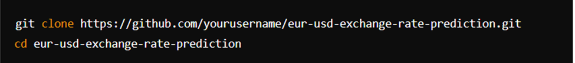

2.	Install the required packages:
 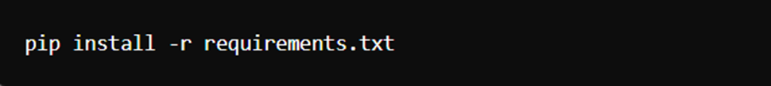

3.	Run the script:
 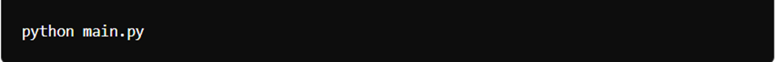
 
4.	Check the output: The results, including the visualization and model performance metrics, will be displayed and saved accordingly.

